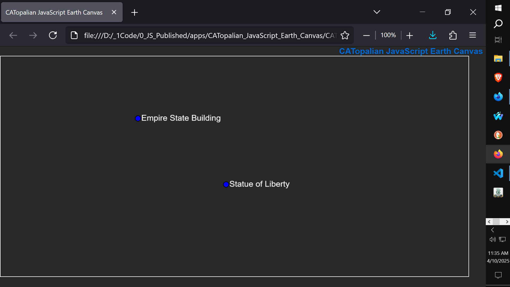

# CATopalian JavaScript Earth Canvas
A JavaScript application that uses Canvas to enable Longitude and Latitude Map Coordinate Markers to be placed on a screen that is draggable.  

---

### How to Download this App
1. Click the green Code Button on this github page
2. Choose Download ZIP
3. Save the Zip File
4. Extract All
5. Double click the HTML file to start the App

---

Happy Scripting :-)

